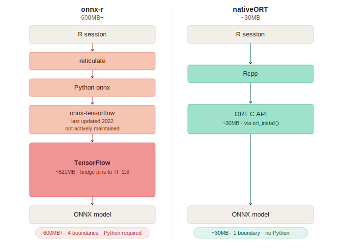
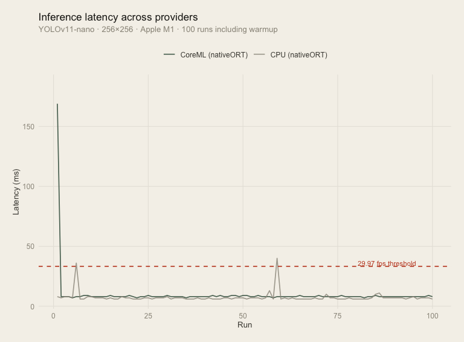
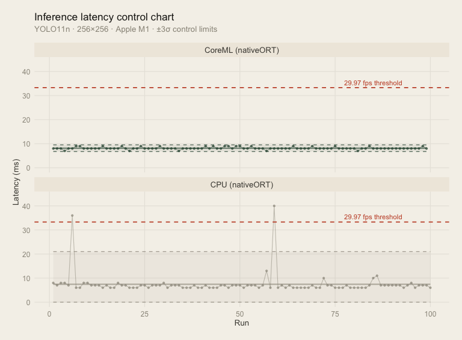

# nativeORT

Awaiting CRAN approval*

---

**Native ONNX Runtime inference for R, no Python required.**

nativeORT is the only R-native ONNX inference engine with no Python/reticulate dependencies. 
Built on direct C++ bindings to the onnxruntime C API, inference runs entirely within R.

nativeORT can run at real-time speeds, and Apple Silicon users can access the CoreML Execution
Provider. To the author's best research, this is the first R package with direct CoreML access
which does not rely on reticulate or python bridging.

---

## Why nativeORT?

The existing R interface for ONNX Runtime routes through Python/reticulate with Tensorflow
backends in Python. Bridging, non-R dependencies, and a large footprint make this a non-ideal
solution. As of publication, the existing packaging has not been had a new release
since 2021. Additionally, the onnx-tensorflow dependency has not been actively maintained.
nativeORT exists to bridge this gap for AIML practitionersin R who want a modern,
R-native approach that runs fast without a large number of dependencies.

<p align="center">
  
</p>

## Installation

Install from Github, within R

```r
remotes::install_github("github.com/calebmcarr/nativeort")
```

nativeORT comes with a smart ONNX Runtime installer to detect your platform and install
the correct ORT 1.25.1 binary and verify the install. On first install:

```r
library(nativeORT)
ort_install()
```

After this, you can start inferencing on .onnx engines!

## Usage

### Creating an ORT Session

You'll need access to a .onnx file. Here's we'll use YOLOv11 nano from ultralytics as an
example.

```r
session <- nativeORT::ort_session(model_path)
```

### Inferencing

Now that you've created an ORT session (which handles all of the threading setup, etc.),
you can inference easily with standard R arrays.

```r
# typical RGB 256x256 image
input <- array(
  runif(1 * 3 * 256 * 256),
  dim=c(1L, 3L, 256L, 256L)
)

raw <- nativeORT::ort_infer_raw(session, input)
```

### CoreML Access

For users with Apple Silicon, nativeORT allows you to tap directly into the CoreML Execution
Provider, with dedicated hardware for more stable inferencing.

It's easy, only requiring a change in the session creation:

```r
// optional, explicitly creating cache dir helps speedup
dir.create(path.expand("~/.nativeORT/cache"),
           recursive = TRUE, showWarnings = FALSE
           )
session <- nativeORT::ort_session(model_path,
                                  provider='coreml',
                                  cache_dir=path.expand("~/.nativeORT/cache")
           )
```

### Benchmarks

nativeORT is fast, and supports real-time inferencing, opening up video streaming possibilities
without requiring Python.

Below is a benchmark on Apple M1 Silicon, targeting YOLOv11-nano on 50 consecutive 256x256 frames.
Tested with both the CPU and CoreML providers, we have a median inference time of 7-8 milliseconds, 
respectively (further discussion at [Benchmark Performance](vignettes/BenchmarkPerformance.Rmd)).


<p align="center">
  
</p>

And here are the control charts for latency. Both providers
are well within our threshold, even when accounting for a 3 sigma interval.Bene Nota: for this chart,
the warmup was excluded.

<p align="center">
  
</p>

### AI Disclaimer

This code was written by me, and the logic human-made. The charts in this README were aided with the
help of AI tooling, however, as my eye for graphic design is not quite as keen.

### Author

Caleb Carr is an AI Engineer with an academic background in Applied Statistics.
